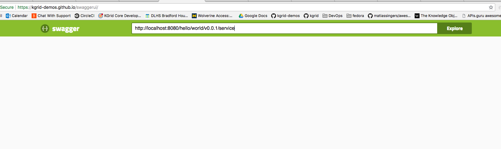

## Accessing KO Services/Endpoints in the Activator

### Service Description

Each Knowledge Object (KO) is required to have a service description which is a definition of what  
services a KO provides and how it is access those services. The service description use the
[OpenAPI Specification](https://en.wikipedia.org/wiki/OpenAPI_Specification). 

### Accessing Service Description

OpenAPI document for each KO can be found via the path described in the _service_ attribute of the 
KO's metadata data. Lets look at Hello World KO. You can view the metadata of the 
[Hello World 0.0.1](http://localhost:8080/hello/world//v0.0.1). 

To view a service Description for a KO you a _service_ to the URL you used ot access the metadata of the 
 KO, e.g. [Hello World Service Description](http://localhost:8080/hello/world/v0.0.1/service).

The output is a yaml [OpenAPI Specification](https://en.wikipedia.org/wiki/OpenAPI_Specification). 
This specification is a maching readable format and might not mean much when you first view it.  
There are several tools the can interpret this specification and render a useful client based on the
the information.  
 
### Using the Service Description
Swagger UI client can take a KOs service description and create a client that can aid in executing the 
KOs services.  

  1. In your browser navigate to [KGrid's Swagger UI](https://kgrid-demos.github.io/swaggerui/) implementation 
  1. In the Explore text box type in the service url for the Hello World KO 
  ( http://localhost:8080/hello/world/v0.0.1/service ) <kbd></kbd>

  1. Press Explore which will load the service description into Swagger UI and render a simple client. 

Show how to use the kgrid-demos.github.io Swagger UI client with a local/remote activator
Swagger Inspector

### OpenAPI service description